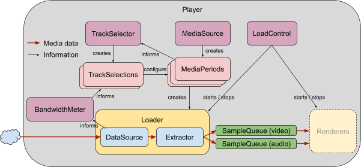
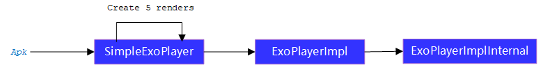
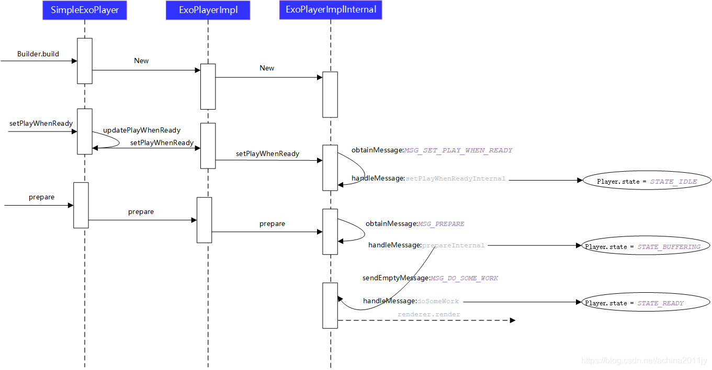

# ExoPlayer
ExoPlayer播放器是一款Google推出的应用级播放器，其本质是调用了MediaCodec组件进行音视频的解码及播放。

+ 架构图

首先是由loader来协调DataSource和extractor，前者来识别MediaSource类型，后者用来解媒体封装，在获取了audio/video的元数据之后，分别送入到音视频的渲染器render中，render的功能展示在上二图，render中会去协下层的解码器进行解码，同时，将解码后的音频数据写入AudioTrack进行播放，视频数据写到Surface进行渲染。

+ 播放器实例

#### 参考资料
+ [《ExoPlayer简单使用》](https://www.jianshu.com/p/7cecaa990605)
+ [《ExoPlayer系列》](https://blog.csdn.net/achina2011jy/article/details/112602262)